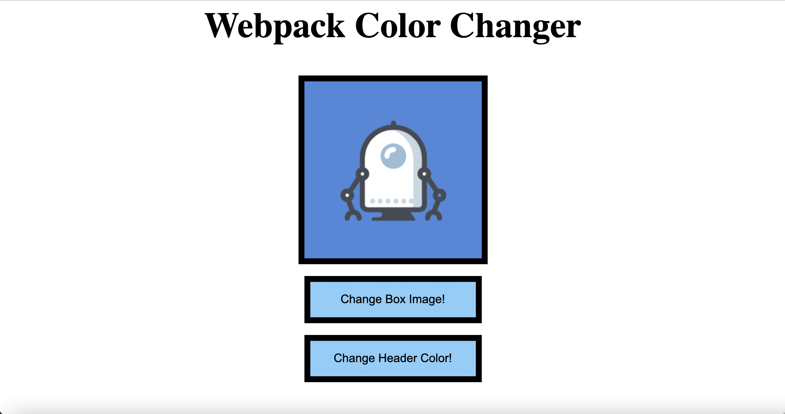
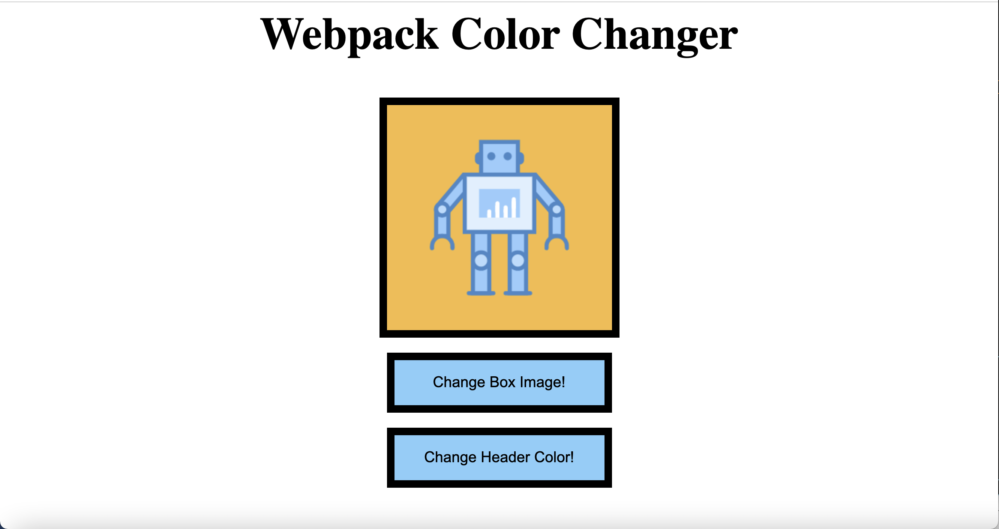

# 📖 Bundle Images Using webpack

Work with a partner to implement the following user story:

* As a developer, I want to incorporate images into my webpack bundle so that they display on my app.

## Acceptance Criteria

* It's done when I have updated the `webpack.config.js` file to handle image assets.

* It's done when I have imported images into the `index.js` and `box.js` files as `Blue` and `Yellow`.

* It's done when I have set the `#box` element's src to `Yellow` to provide a default image when the page loads.

* It's done when I use `npm i` and `npm run build` to successfully build a `dist` folder and manually add the `index.html` file.

* It's done when I open the `dist/index.html` in the browser using Live Server and the images are displayed in the app.

## 📝 Notes

Refer to the documentation:

[webpack docs on loading images](https://webpack.js.org/guides/asset-management/#loading-images)

## Assets

The following images demonstrate the web application's appearance and functionality:

---

## 💡 Hints

* When webpack bundles the asset it changes the asset name to a string of numbers and letters like this: `29822eaa871e8eadeaa4.png`. How do we access this bundled image in our project?

## 🏆 Bonus

If you have completed this activity, work through the following challenge with your partner to further your knowledge:

* How can we use webpack's asset management to bundle fonts and data?

Use [Google](https://www.google.com) or another search engine to research this.

---
© 2023 edX Boot Camps LLC. Confidential and Proprietary. All Rights Reserved.
